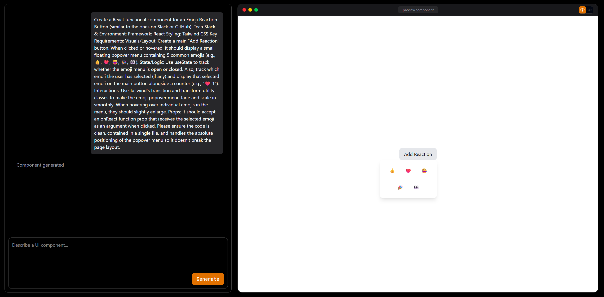

# ⚡ AI Component Builder

An AI-powered playground that generates **React + Tailwind CSS components instantly from prompts**.  
Describe the UI you want and the AI generates the component with a **live preview and editable code**.

Built for developers who want to **prototype UI faster using AI**.

---

## 🚀 Features

- 🤖 **AI Component Generation** – Generate React components from natural language prompts
- ⚡ **Instant Live Preview** – Render the generated component immediately
- 🧠 **Monaco Code Editor** – Full-featured code editor for editing AI output
- 🔄 **Preview / Code Toggle** – Switch between UI preview and code view
- 📋 **Copy Code** – One-click copy for generated components
- 🎨 **Tailwind CSS Ready** – Components are styled using Tailwind
- 🧩 **Component Playground** – Experiment and iterate on components in real time

---

## 🖥️ Demo




---

# 🏗️ Tech Stack

### Frontend
- React
- Redux Toolkit
- Tailwind CSS
- Monaco Editor

### AI
- OpenAI API

### Deployment
- Vercel

---

# 📂 Project Structure

```
AI-Component-Builder
│
├── public # Static assets
│
├── src
│ ├── components # UI components
│ │ ├── playground
│ │ │ ├── tabs
│ │ │ │ ├── CodeEditor.jsx
│ │ │ │ ├── Preview.jsx
│ │ │ │ └── PreviewTabs.jsx
│ │ │ ├── PromptInput.jsx
│ │ │ └── Webmockup.jsx
│ │ │
│ │ └── chats
│ │ └── ChatMessages.jsx
│ │
│ ├── features # Redux state management
│ │ ├── ai
│ │ │ └── aislice.js
│ │ └── playground
│ │ └── playgroundslice.js
│ │
│ ├── pages # Application pages
│ │ ├── Home.jsx
│ │ └── Playground.jsx
│ │
│ ├── services # API calls
│ ├── utils # Helper functions
│ │
│ ├── App.jsx
│ └── main.jsx
│
├── package.json
├── tailwind.config.js
├── vite.config.js
└── README.md
```
## ⚙️ Installation

Clone the repository

```
git clone https://github.com/GokulKrishnaK771/AI-Component-Builder.git
```
Move into the project
```
cd ai-component-builder
```
Install dependencies
```
npm install
```
Run the development server
```
npm run dev
```
---

```
## 🔑 Environment Variables

Create a `.env` file in the root directory and add:


VITE_GROQ_API_KEY=your_groq_api_key


This key is used to generate UI components from the AI model.

```
## 🧠 How It Works

1. User enters a prompt describing a UI component.
2. The prompt is sent to the OpenAI API.
3. The AI generates a React component using Tailwind CSS.
4. The generated code appears in the Monaco Editor.
5. The component renders instantly in the preview panel.

## 🛠 Example Prompt

Create a modern pricing card with 3 plans and highlight the pro plan

## 📦 Deployment

This project can be deployed easily on **Vercel**.

Steps:

1. Push the repository to GitHub
2. Import the project in Vercel
3. Add the environment variable

## 💡 Future Improvements

- Component history
- Prompt templates
- Multi-component generation
- Export component to project
- Figma design import
- UI component library
- Multi Code Language support

## 🤝 Contributing

Contributions are welcome.

If you'd like to improve the project:

1. Fork the repository
2. Create a new branch
3. Make your changes
4. Submit a pull request
